# password locker
Password manager for android using AES-256 Encryption

### Introduction

Annoyed of forgetting your access data for hundreds of services, apps and co.?
Do you want a secure way of saving all your passwords instead of writing them down on a sheet of paper?
Password Locker is your solution! It stores and manages all entered data in an encrypted way, so you have a secure storage of your access data and you only have to remember your master-password.
You can trust Password Locker as it does not have any access to the internet. Password Locker uses AES 256-bit encryption to secure your data.
Note, that there is no sync-feature, because of the missing internet-permissions. So if you want to share the database, upload it to Dropbox (or similar) and import it from there on another device.

### Features

- Open Source
- **AES-256** Encryption
- **Totally Offline** - we don't even require an internet access permission
- Quick access your credentials

### Screenshots

|     | 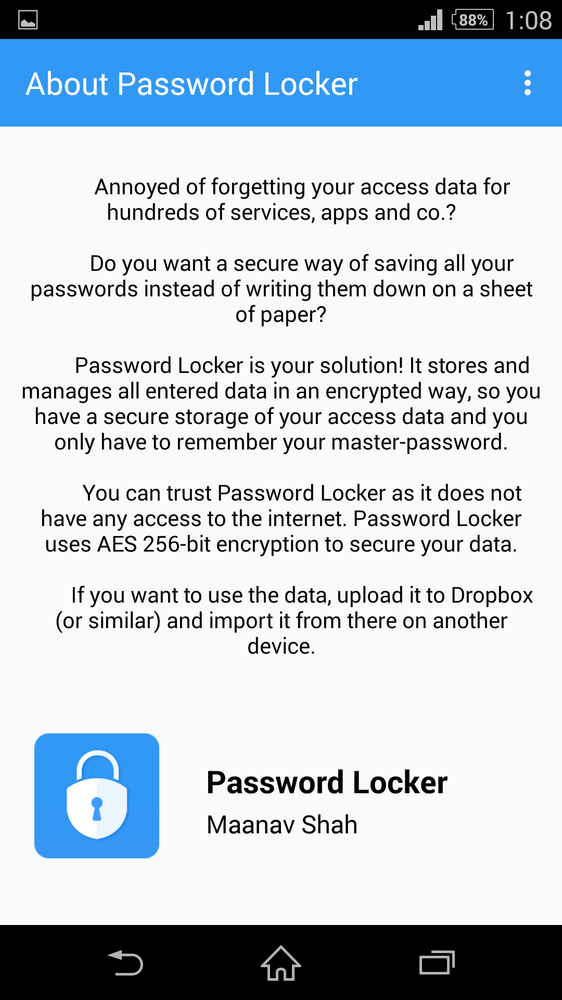 | 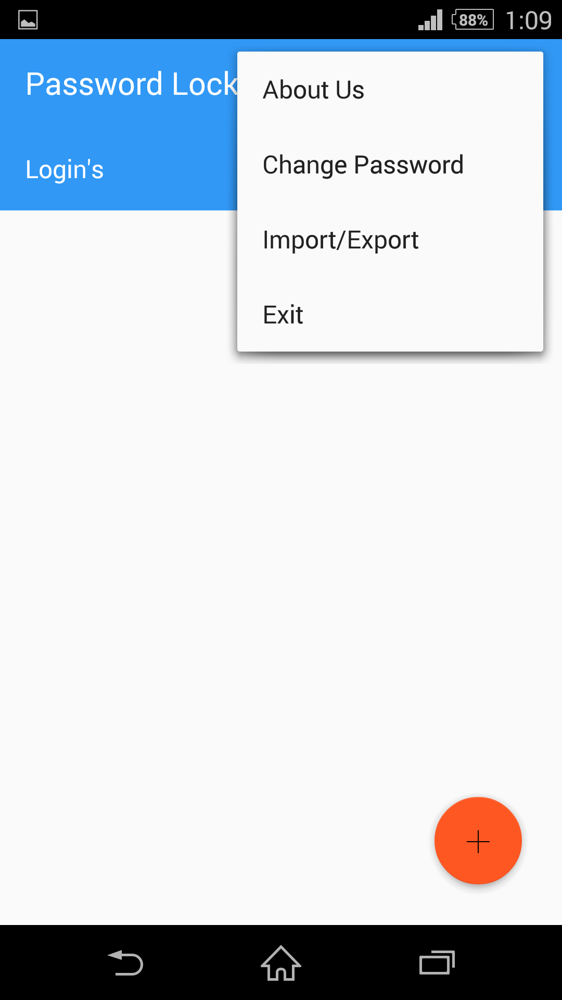     | 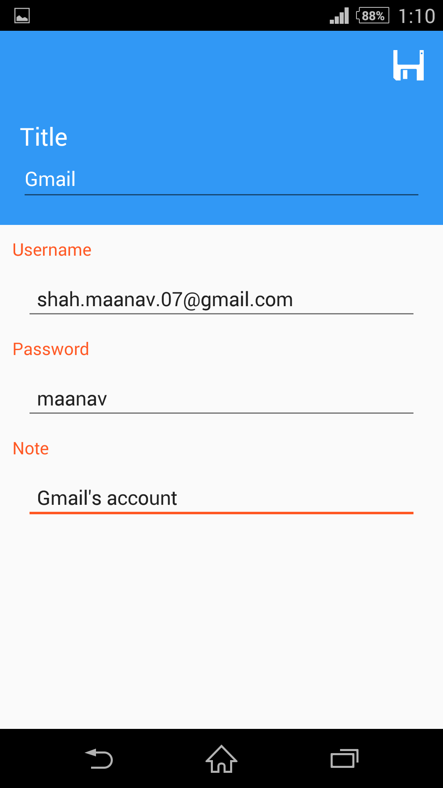  |
| --------------------------------------- | ---------------------------------------- | ---------------------------------------- | ---------------------------------------- |

|     | 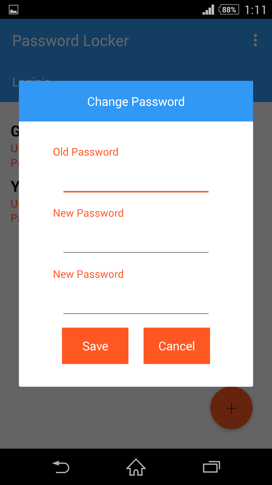 | 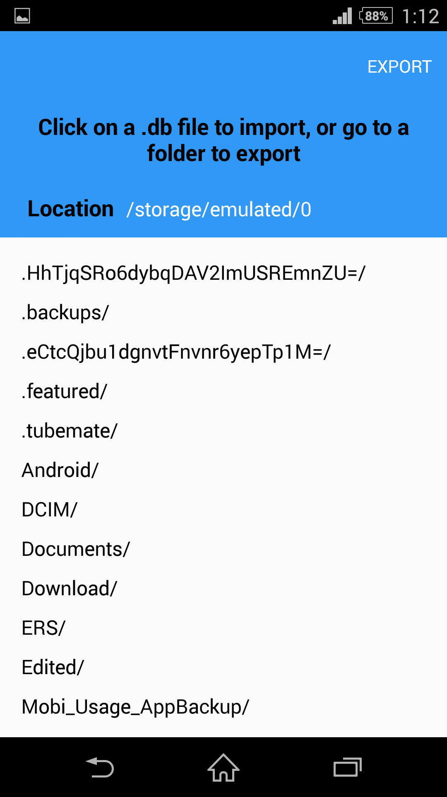 | 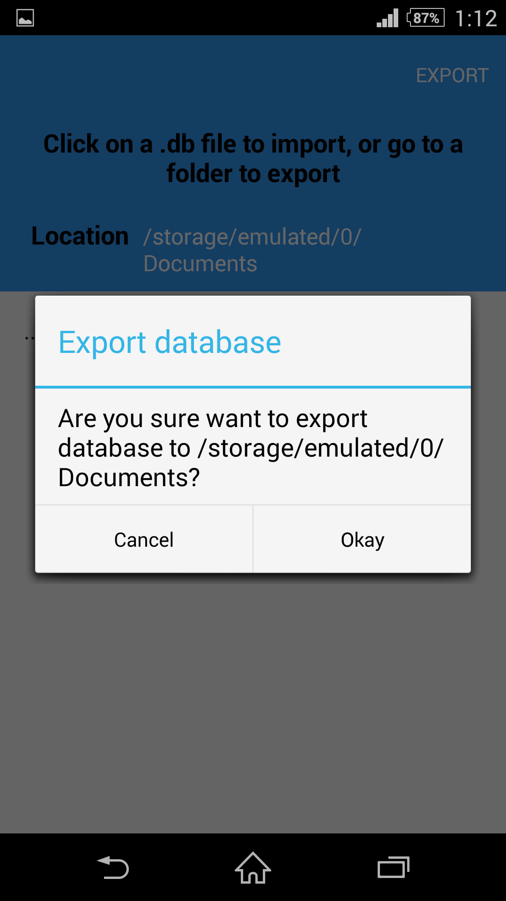 |
| ---------------------------------------- | ---------------------------------------- | ---------------------------------------- | ---------------------------------------- |

|     | 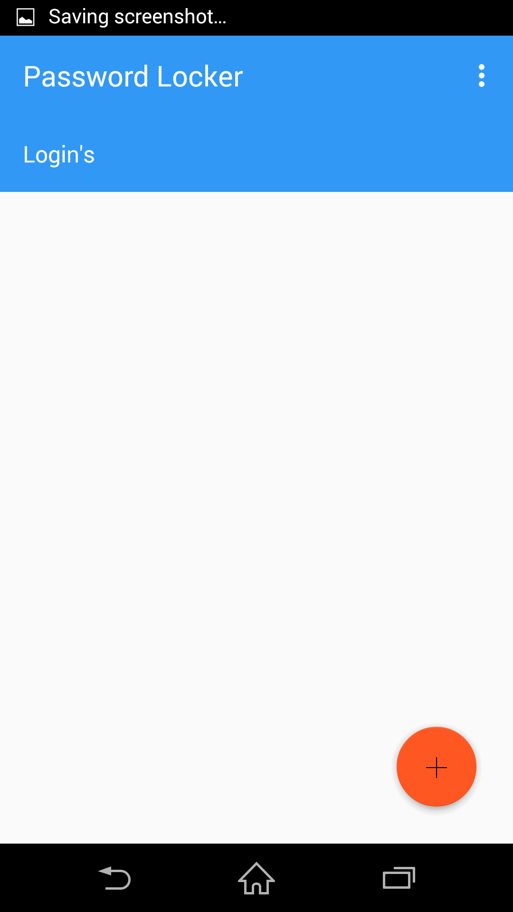 | 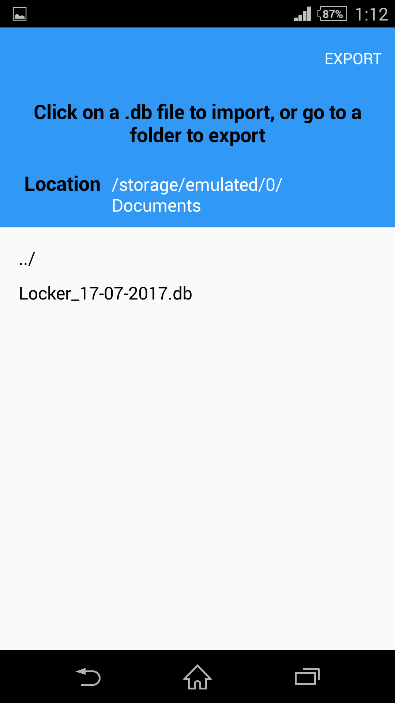 | 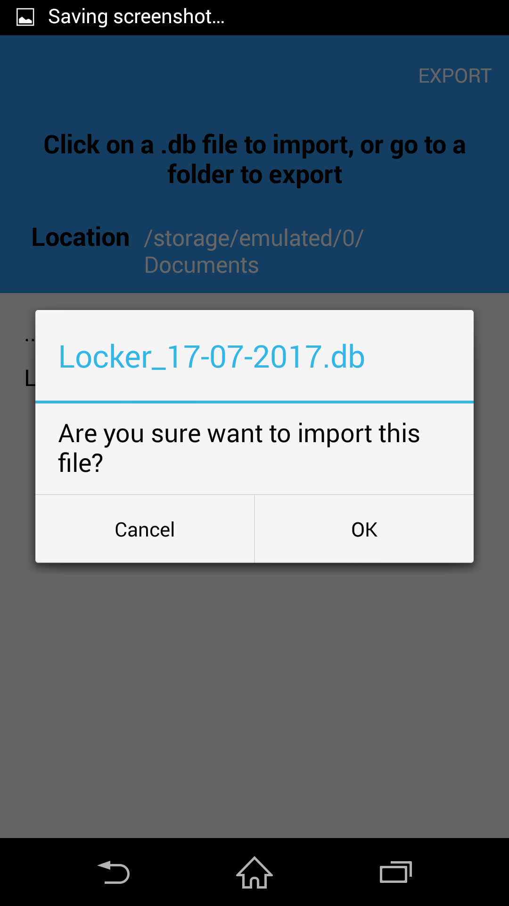 |
| ---------------------------------------- | ---------------------------------------- | ---------------------------------------- | ---------------------------------------- |

|    | 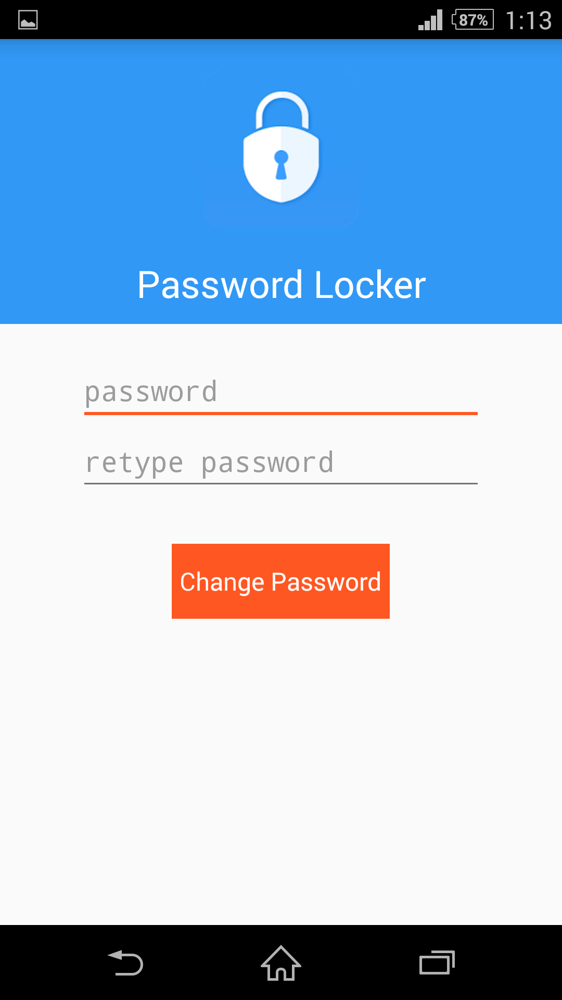 | 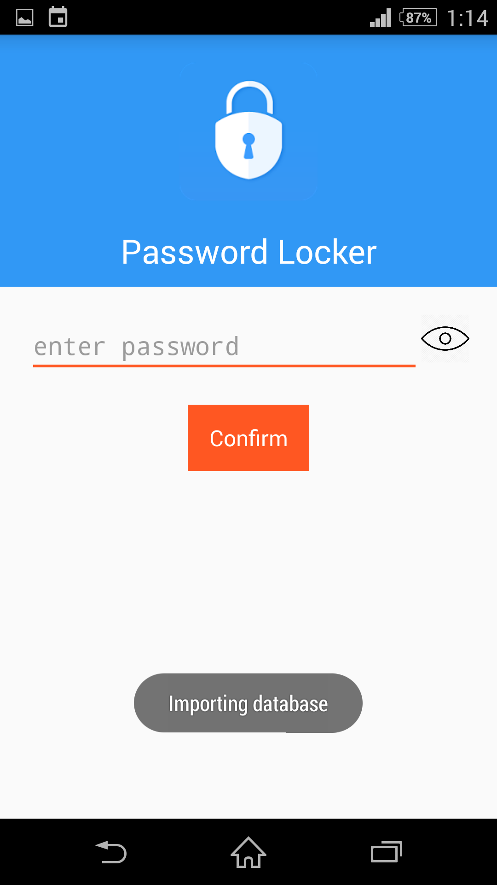 | 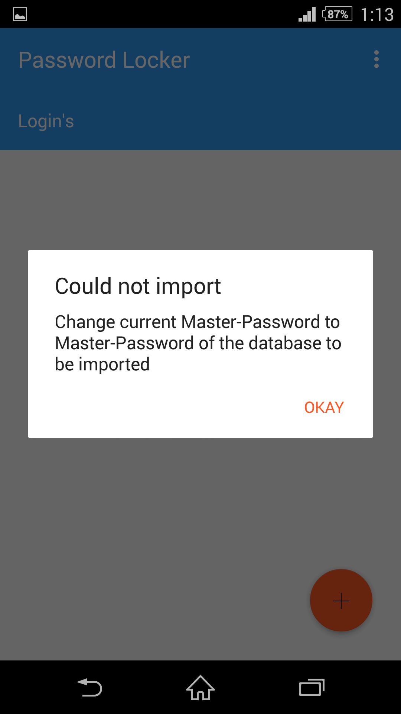 |
| --------------------------------------- | ---------------------------------------- | ---------------------------------------- | ---------------------------------------- |

### How does it works ?

##### Design Guideline

Like other password manager, Password Locker also use a master password for encryption & decryption. All your credentials are encrypted with it using `AES 256-bit Encryption`.

Password Locker's most important design guideline is we **DO NOT** upload your database to anywhere. Not to a cloud or self-hosted server. We **DO NOT** require internet permission in this app. All your credentials are in your local storage safely.

Second guideline is, we try to avoid store your master password, even if it's the encrypted. We need you enter your master password on demand.

### Installation

To build and run the app, clone this project, open it as an existing project in Android Studio, and click Run.

### Support

- Android 4.0 +

### Contributing

Bug reports and pull requests are welcome on GitHub at https://github.com/maanavshah/password-locker. This project is intended to be a safe, welcoming space for collaboration, and contributors are expected to adhere to the [Contributor Covenant](http://contributor-covenant.org) code of conduct.

### License

The content of this repository is licensed under [MIT LICENSE](LICENSE).
